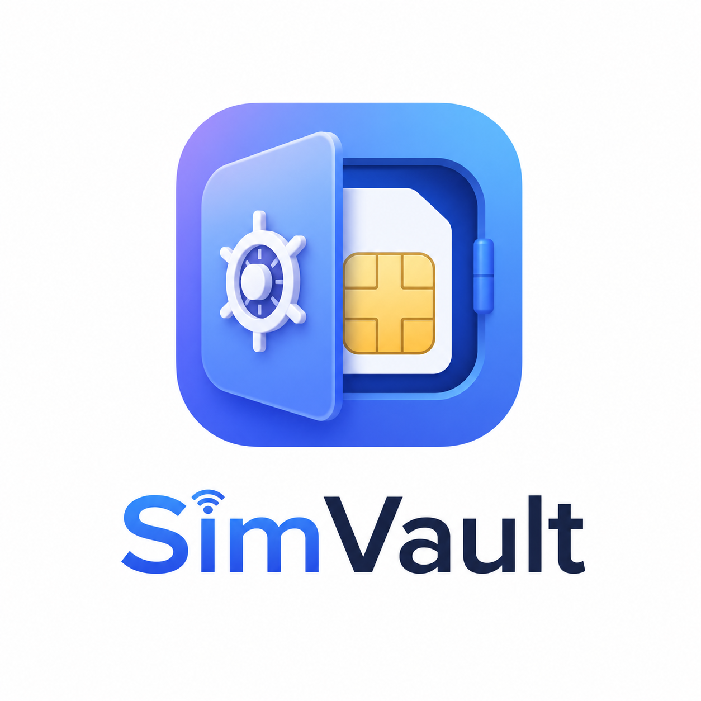
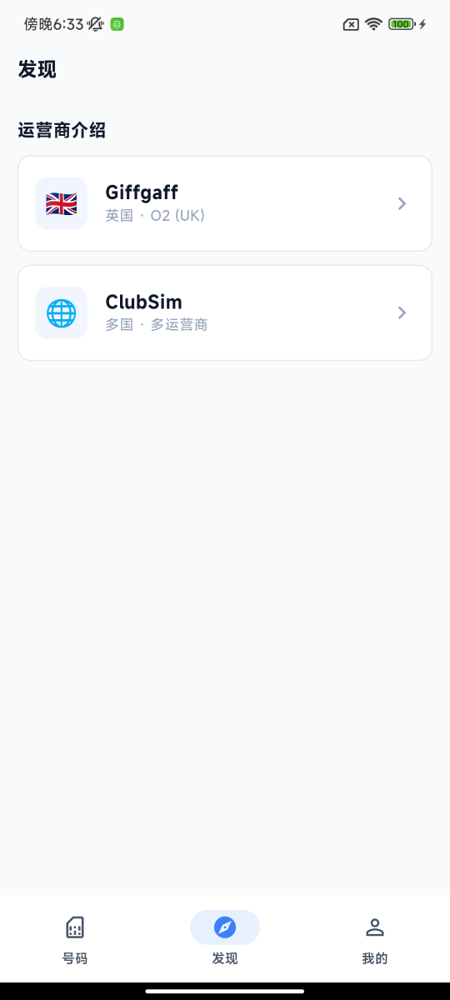
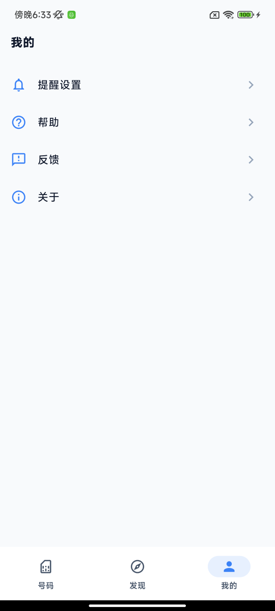

# SimVault

一款用于管理多张 SIM 卡和手机号码的移动应用。

## 功能

### 号码管理

- 添加和管理多个手机号码
- 支持选择运营商（含自定义下拉选择）
- 记录号码的保号日期，追踪有效期
- 设置到期提醒，避免号码因欠费或未使用而被注销

### 发现

- 查看各运营商的详细介绍

### 我的

- 提醒设置：管理号码到期通知偏好
- 帮助与反馈：查看使用说明、提交使用反馈
- 关于：查看应用信息

## 版权声明

© 2026 SimVault. 保留所有权利。

本项目仅供个人学习和非商业用途使用，**严禁将本项目或其任何部分用于任何商业目的**。未经作者明确授权，不得复制、分发、修改或以任何形式用于商业场景。
